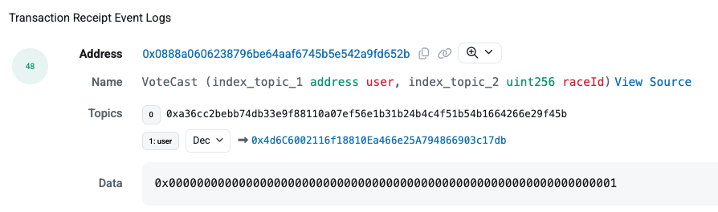
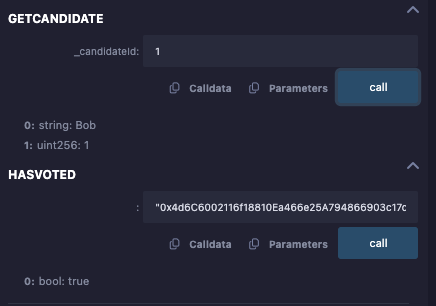

## Overview 📝

Created the Voting contratct and Remix and play with different functions.

### Deployed contract

- Contract available at : [0x0888a0606238796BE64aAF6745B5e542A9FD652b](https://sepolia.etherscan.io/address/0x0888a0606238796BE64aAF6745B5e542A9FD652b)
- Voting : [0xc80f99409c1b0117296602a564cbe4854deaccea7d5d24f367099c686729dc74](https://sepolia.etherscan.io/address/0x4d6c6002116f18810ea466e25a794866903c17db)

Log of event :

Use getCandidate function to have the count of vote for the candidate in parameter.
Use hasVoted function to check if an address has voted.

