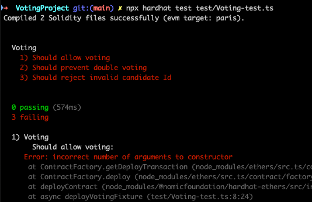
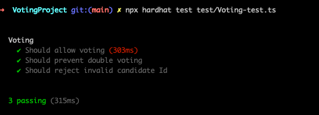

## Overview 📝

Creating a hardhat project and copy our Voting contract in contract folder.
Write a full test [Voting-test.ts](../day3/VotingProject/test/Voting-test.ts) with TypeScript, I use loadFixture to deploy the contract.

First time I ran tests, they failed, because I made an error on constructor call of Voting contract.

Second time, was ok.

### Resources

- [Hardhat - Testing Contracts](https://v2.hardhat.org/hardhat-runner/docs/guides/test-contracts) (testing guide).
- [Mocha Docs](https://mochajs.org/) (test framework overview).
- [Chai Docs](https://www.chaijs.com/) (assertion library reference).
- [Ethers.js Docs](https://docs.ethers.io/v5/) (contract interaction in tests).

### Livrable

