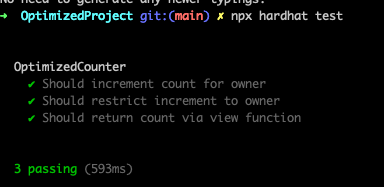

## Overview 📝

Use Hardhat to create the OptimizedCounter contract.
Create a deploy.ts script to deploy directly on Sepolia with Infura.

Had somes troubles with the test script because I use TypeScript.
For using TypeScript we need to follow theses steps :

1. Compiling contracts with `npx hardhat compile`
2. Check generated TypeScript file for each contract on `/typechain-types/` folder.
3. Add `@typechain/hardhat`on `hardhat.config.ts`file : `import "@typechain/hardhat";`
4. Import your contract directly on your test script : `import { OptimizedCounter } from "../typechain-types";`

### Deployed contract

- Contract created : [0xD226Cd4f8C0bAf662508285e9F412d24A9bf2AC0](https://sepolia.etherscan.io/address/0xd226cd4f8c0baf662508285e9f412d24a9bf2ac0)

### Livrable

