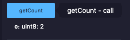
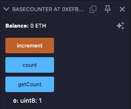

## Overview 📝

### Deployed contract

- DerivedCounter contract : [0x14d95a4005C45c6D493466972ee41DD6Aa682FCA](https://sepolia.etherscan.io/address/0x14d95a4005c45c6d493466972ee41dd6aa682fca)

- Increment transaction : [0xdef9d06ccad07dee631b872e89ef50661b9754c5801a1eb689f67fc73912c915](https://sepolia.etherscan.io/tx/0xdef9d06ccad07dee631b872e89ef50661b9754c5801a1eb689f67fc73912c915)

- Call of GetCount :

- BaseCounter contract : [0xEFb323E9E1fB7242976Cc67E82D36DD782d64087](https://sepolia.etherscan.io/address/0xefb323e9e1fb7242976cc67e82d36dd782d64087)

- CallInterface transaction : [0x0f15c76b49deea7a5290222a99c68c73db721121678092d74e5e66779edc59e5](https://sepolia.etherscan.io/tx/0x0f15c76b49deea7a5290222a99c68c73db721121678092d74e5e66779edc59e5)

- Result : GetCount on BaseCounter returns 1 :

