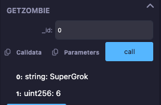
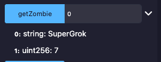

## Overview 📝

Writed a SuperZombie contract, inherited from Zombie contract and play with it.
SuperZombie contract had Onlyowner restriction.
Contract file : [InheritedZombie.sol](../day2/InheritedZombie.sol)

### Deployed contract

- SuperZombie contract : [0x63e1D7eb033F435d30D77228CADDDE6dD86Ff2AD](https://sepolia.etherscan.io/address/0x63e1d7eb033f435d30d77228caddde6dd86ff2ad)

- CreateZombie transaction : [0xe950a5f1f1a9c4f70f1e05dc62b366ab3bbcc124ca76f95f1c7d0d0ed0c5da21](https://sepolia.etherscan.io/tx/0xe950a5f1f1a9c4f70f1e05dc62b366ab3bbcc124ca76f95f1c7d0d0ed0c5da21)

- UpgradeLevel transaction : [0x98ef00e9b8569262f0cba8e970763a24e6813b15f21b3a5caf3fa125680d81b9](https://sepolia.etherscan.io/tx/0x98ef00e9b8569262f0cba8e970763a24e6813b15f21b3a5caf3fa125680d81b9)

