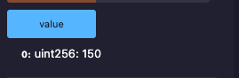

## Overview 📝

Writed a Library on Remix, called SafeMathLibrary, with two methods (add and sub).
Writed another contract called LibraryTest.
This contract import SafeMathLibrary, and had two functions (addValue and subValue). Theses two function uses methods of Library imported.

### Deployed contract

- LibraryTest contract : [0x87d10e26e2ff2146e063780E26A3aDC35280450A](https://sepolia.etherscan.io/address/0x87d10e26e2ff2146e063780e26a3adc35280450a)

- Call addValue with 50 as parameter : Result would be 150 :
  [0x307c198f6204c2a1ea22d38a08ae06976cc2bb9abb99f8ce4be362524f0c1525](https://sepolia.etherscan.io/tx/0x307c198f6204c2a1ea22d38a08ae06976cc2bb9abb99f8ce4be362524f0c1525)

  

- Call subValue with 30 as parameter : Result would be 120 :
  [0xbbebdfae19f58711d76734207eb4d59e4cb196a043df48d284c19f3260879bf1](https://sepolia.etherscan.io/tx/0xbbebdfae19f58711d76734207eb4d59e4cb196a043df48d284c19f3260879bf1)

  
