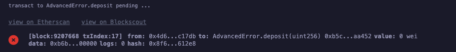

## Overview 📝

Testing `error` with a simple contract.

### Deployed contract

- AdvancedError Contract : [0xb5CE14BeA4265c9FD0388F2e9A069D1061Daa452](https://sepolia.etherscan.io/address/0xb5ce14bea4265c9fd0388f2e9a069d1061daa452)

- Deposit(0) will fail : [0x2ec9a4077c36296cd6605a0291f644404c36345da6414e535b01ff6180189611](https://sepolia.etherscan.io/tx/0x2ec9a4077c36296cd6605a0291f644404c36345da6414e535b01ff6180189611)

