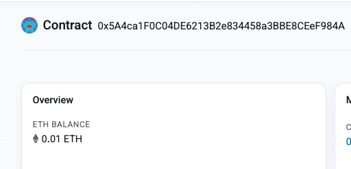
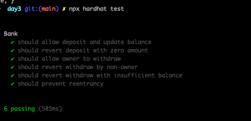

## Overview 📝

Deploy and test Bank.sol contract, with implementation of somes securities methods

### Deployed contract

- Bank contract deployed : [0x5A4ca1F0C04DE6213B2e834458a3BBE8CEeF984A](https://sepolia.etherscan.io/address/0x5a4ca1f0c04de6213b2e834458a3bbe8ceef984a)

- Deposit 0.01ETH : [0x32c15f733d0142665808100c302e1684b6144575ece4fc27d10517889e0dacc5](https://sepolia.etherscan.io/tx/0x32c15f733d0142665808100c302e1684b6144575ece4fc27d10517889e0dacc5)

- Withdraw from Owner : [0x60a317774ab525bd998a01f055ed40489ba71c8c41726fd7729cb0d946850c62](https://sepolia.etherscan.io/tx/0x60a317774ab525bd998a01f055ed40489ba71c8c41726fd7729cb0d946850c62)

- Withdraw from NonOwner : [0xad561ac05592d282d005ace6610e7f2a844ef3c17fd8601a4c66df1ff42b3e0e](https://sepolia.etherscan.io/tx/0xad561ac05592d282d005ace6610e7f2a844ef3c17fd8601a4c66df1ff42b3e0e)

- Withdraw with Insufficient Balance : [0x56bb6b5eecc30cd9717d577a26f3431717bffc30a3d896e65d0879af2e402e5a](https://sepolia.etherscan.io/tx/0x56bb6b5eecc30cd9717d577a26f3431717bffc30a3d896e65d0879af2e402e5a)

- Deployed via Hardhard and tested :

