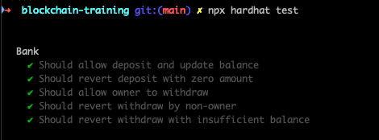

## Overview 📝

Create a Bank smartcontract on a `blockchain-training`folder with hardhat.
Create deployment script with TypeScript.
Create test script with TypeScript.
Test with hardhat.
Deploy on Sepolia with hardhat.

### Deployed contract

- Bank Contract : [0x15D50f0A8f13f4274E90AE90D6bC1fC65A3BCFd9](https://sepolia.etherscan.io/address/0x15d50f0a8f13f4274e90ae90d6bc1fc65a3bcfd9)

