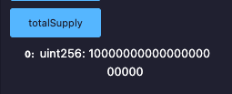
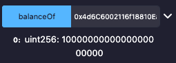

## Overview 📝

Write and deploy GrokToken on Sepolia using openZeppelin and Remix.

### Deployed contract

- GrokToken Contract : [0x76755076Df6B54D285bFA4b6979Ec0F128C75501](https://sepolia.etherscan.io/address/0x76755076df6b54d285bfa4b6979ec0f128c75501)

- Call totalSupply :

- Call balanceOf(Deployer) :

- Call transfer(receiver, 100) : Tx : [0xba4debf03384d18f416160ee147f5f313a473bdf455c7ddd72ac73a7a39fbc1e](https://sepolia.etherscan.io/tx/0xba4debf03384d18f416160ee147f5f313a473bdf455c7ddd72ac73a7a39fbc1e)

- Call approve(spender, 50) : Tx : [0xbd061789e924798ef998de1c5a6b23bcd86e26d89a06ac91f3cd22b3e9d02b77](https://sepolia.etherscan.io/tx/0xbd061789e924798ef998de1c5a6b23bcd86e26d89a06ac91f3cd22b3e9d02b77)

- Call transferFrom(deployer, receiver, 50) : Tx : [0x2a12c80241248ec0b9be52c2e0663467b8d3cb1f5952a6aff6651845500274de](https://sepolia.etherscan.io/tx/0x2a12c80241248ec0b9be52c2e0663467b8d3cb1f5952a6aff6651845500274de)

- Call mint(receiver, 200) from Owner : Tx [0x21ef1f7d9ae6d54b101ae5503add7eb614c6bde71f4f78f52b6b3e4e6d7c3f98](https://sepolia.etherscan.io/tx/0x21ef1f7d9ae6d54b101ae5503add7eb614c6bde71f4f78f52b6b3e4e6d7c3f98)

- Call mint from non-owner : [0x26a6d198e62cda871a53d3d7ecb97273f45db574ebe6dc2bf0b122e4fb286d12](https://sepolia.etherscan.io/tx/0x26a6d198e62cda871a53d3d7ecb97273f45db574ebe6dc2bf0b122e4fb286d12)
