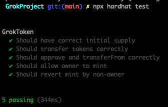
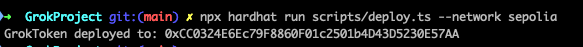

## Overview 📝

Write and deploy GrokToken on Sepolia using openZeppelin and Hardhat.
Write tests by Hardhat.

### Deployed contract

- Testing contract :

- Deploy contract :

- GrokToken Contract : [0xCC0324E6Ec79F8860F01c2501b4D43D5230E57AA](https://sepolia.etherscan.io/address/0xCC0324E6Ec79F8860F01c2501b4D43D5230E57AA)
