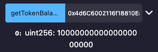

## Overview 📝

Create a TokenCaller contract on Remix.
With an ERC20 interface with implementation of transfer and balanceOf methods.

Deploy it with GrokToken contract address.

### Deployed contract

- TokenCaller contract : [0x427A4c211c3676dA50af3F6BD4CD551777114Ae8](https://sepolia.etherscan.io/address/0x427a4c211c3676da50af3f6bd4cd551777114ae8)

- Call getTokenBalance method :

