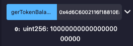

## Overview 📝

Create a TokenInteractor contract on Remix.
With an ERC20 interface, interact with GrokToken contract.

### Deployed contract

- Deploy on Sepolia via MetaMask (use your `GrokToken` address from Week 6 as `_token`).

[0x5D0fF9a39f07BaBaB100bb77b0Ed986605735B42](https://sepolia.etherscan.io/address/0x5d0ff9a39f07babab100bb77b0ed986605735b42)

- Test:

  - Call `getTokenBalance(owner_address)` (returns your GROK balance).

    

  - Call `transferToken(receiver_address, 100 * 10^18)` from owner (transfers 100 GROK).

    [0x7f0d805b2d14375d66af550ca530974489820e61118f371b82838016384fe4b4](https://sepolia.etherscan.io/tx/0x7f0d805b2d14375d66af550ca530974489820e61118f371b82838016384fe4b4)

  - Call `approveSpender(spender_address, 50 * 10^18)` from owner (approves 50 GROK).

    [0x5998db34b530932e8bde8a9473a4f306b46f43fc67f59ed0996767b1d1818a85](https://sepolia.etherscan.io/tx/0x5998db34b530932e8bde8a9473a4f306b46f43fc67f59ed0996767b1d1818a85)

  - Call `transferToken` from non-owner (fails with "Not owner").

    [0x6577e09a6e3bf4744f228b1e52cc39cbb717dcbf97e38a3938c056db60dabb07](https://sepolia.etherscan.io/tx/0x6577e09a6e3bf4744f228b1e52cc39cbb717dcbf97e38a3938c056db60dabb07)
