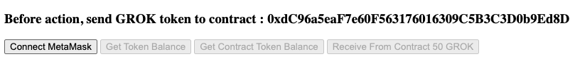
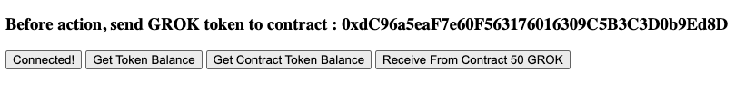
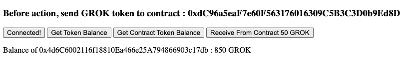
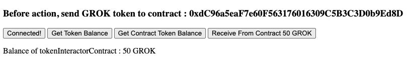
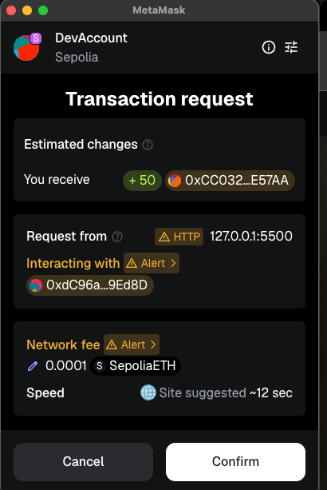
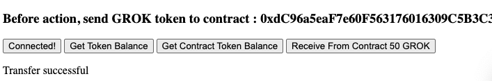
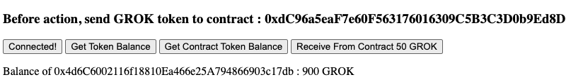
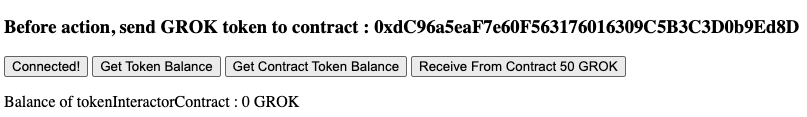

## Overview 📝

Create a FrondEnd to interact with TokenInteractor contract.
Buttons :

- Connect MetaMask : to connect to wallet with MetaMask
- Get Token Balance : Display balance of connected wallet
- Get Contract Token Balance : Display balance of TokenInteractor contract
- Receive from Contract 50 GROK : Transfer 50 $GROK from contract to connected wallet

### Test

- Access to [Page](../day1/index.html)
- Try to connect :

- Check Wallet Balance :

- Check Contract Balance :

- Transfer from Contract to Wallet :

- Check Wallet Balance :

- Check Contract Balance :

