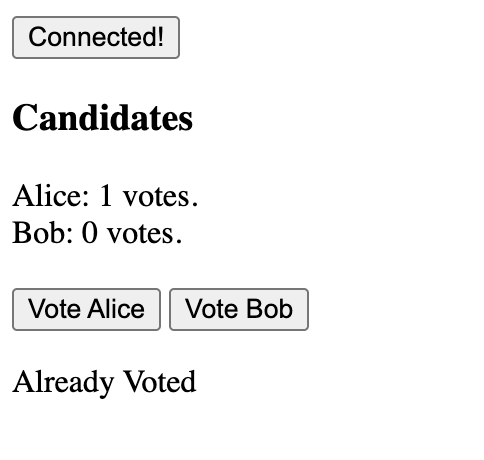

## Overview 📝

Init a new Hardhat project, and copy Voting contract from Week2.
Create TypeScript test (using tests from week2).
Create deployment script and deploy it on Sepolia.

### Tests

Run `npm hardhat test` to have the tests results

### Deployment

Deploy contract with `npx hardhat run scripts/deploy.ts --network sepolia`

Deployed contract : [0x027183dA726d16BA5EE01eB599Ea0F048C14b522](https://sepolia.etherscan.io/address/0x027183dA726d16BA5EE01eB599Ea0F048C14b522)

### FrontEnd

FrontEnd is available here : [Voting DApp](../day2/voting.html)

Details :

- "Connected!" Button : display if your wallet provider is connected or not.
- Candidates : List of candidates with each numbers of votes, data displayed with using `getCandidate` method of contract.
- Alice / Bob Button : Buttons to vote, using `vote` method of contract.
- "Already Voted" message : this messaged is displayed because the connected wallet already vote for one candidate and tried to vote again
