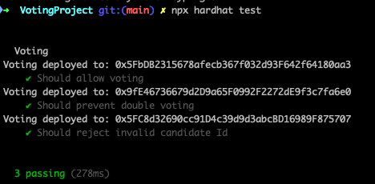

## Overview 📝

Init a new Hardhat project, and copy Voting contract from Week2.
Create TypeScript test (using tests from week2).
Create deployment script and deploy it on Sepolia.

### Tests

Run `npm hardhat test` to have the tests results

### Deployment

Deploy contract with `npx hardhat run scripts/deploy.ts --network sepolia`
Deployed contract : [0x027183dA726d16BA5EE01eB599Ea0F048C14b522](https://sepolia.etherscan.io/address/0x027183dA726d16BA5EE01eB599Ea0F048C14b522)
