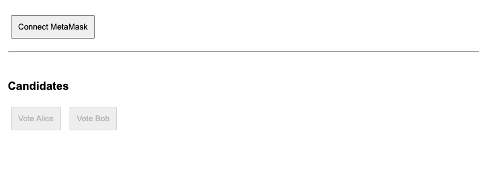
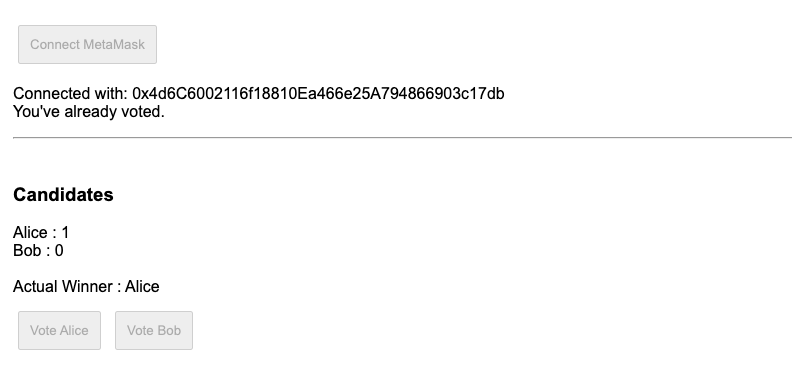
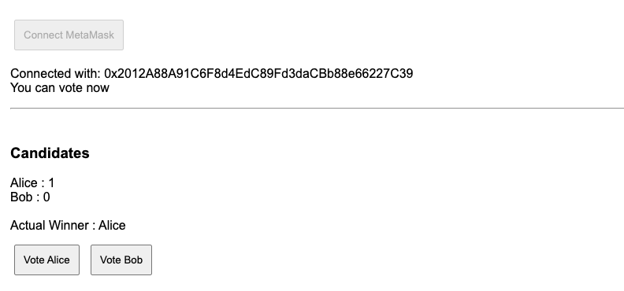
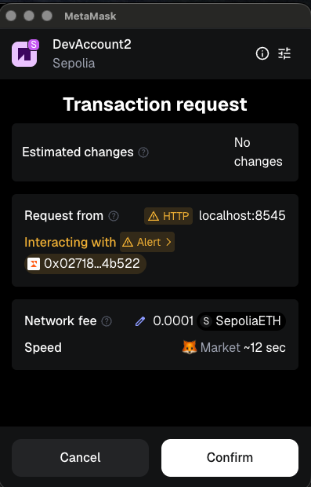
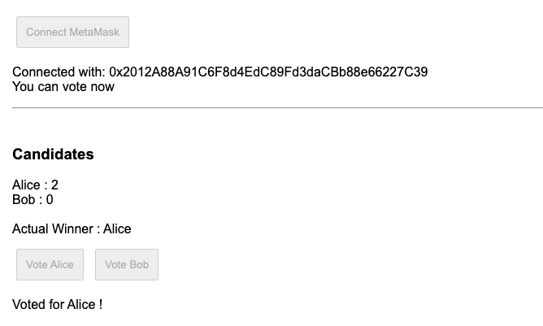

## Overview 📝

Create a FrondEnd for Voting Contract and interact with it with Ethers.JS
Updated the html and script with personnal modification, to set enable of button dynamicly.

### Test

- Access to [Page](../frontend/voting-ethers.html)
- Try to connect :

- Connected with Already Voted Account :

- Connected with No Voted Account :

- Vote for Alice :

- Screen updated :

